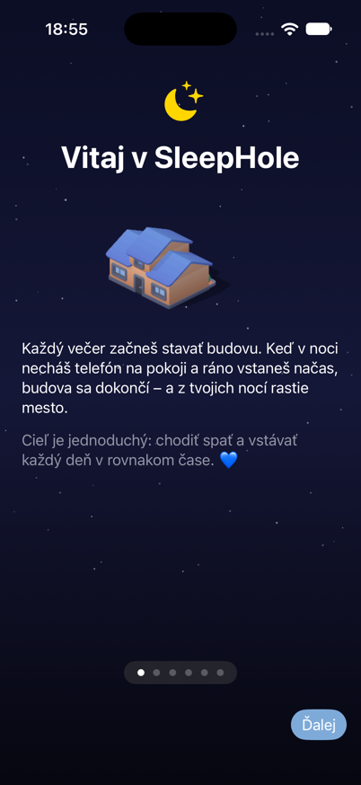
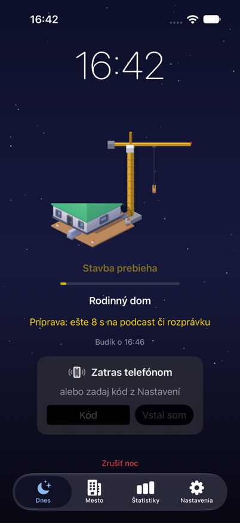
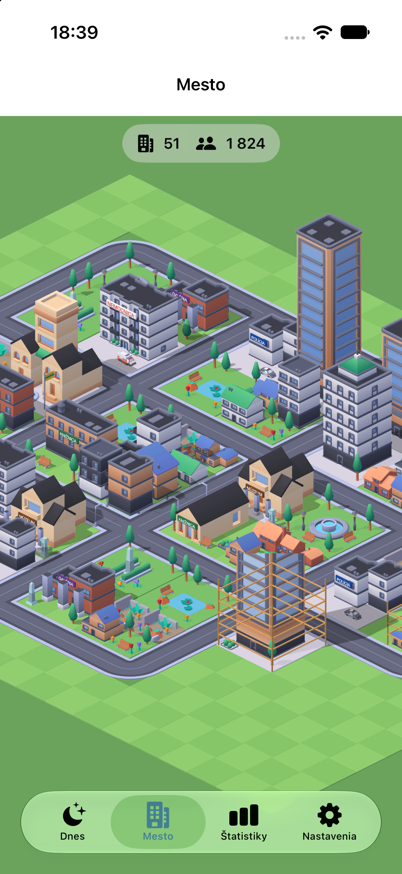

# SleepHole 🌙🏗️

🇬🇧 [English](README.md) · 🇸🇰 Slovensky

Osobná iPhone appka na **pravidelný spánok**, v duchu hry SleepTown. Večer začneš stavať budovu, v noci necháš telefón na pokoji a ráno vstaneš s budíkom. Z každej noci pribudne do mesta jedna budova: hotová, rozostavaná alebo ruina. Mesto tak rastie noc po noci. Tón je milý a nikdy krutý 💙

<p align="center">
  
  
  
</p>

> Natívna appka vo Swifte (SwiftUI, SpriteKit, SwiftData) len pre iPhone. **Nič neblokuje**, appka iba rozpozná, či si z nej v noci odišiel.

---

## Ako funguje noc

| | Pravidlo |
|---|---|
| 🔔 **Pripomienka** | notifikácia pred večierkou (predvolene 30 min) |
| 🏗️ **Začať stavbu** | iba od **večierka − 10 min** do **večierka + 5 min**, inak je noc vynechaná |
| 🎧 **Príprava** | po štarte máš **5 minút** v inej appke (podcast, rozprávka), potom sa vráť do SleepHole |
| 📱 **Noc** | displej môže byť vypnutý, ale SleepHole musí ostať v popredí. Pri odchode príde **„⚠️ Vráť sa!“** a máš **10 s** na návrat, inak sa stavba zrúti |
| 📞 **Výnimky** | telefonát sa nepočíta. Ak appku v noci vypne iOS, počíta sa to v tvoj prospech |
| ⏰ **Budík** | zvoní najviac **2 minúty** (aj v tichom režime) a rozsvieti obrazovku. Vstanie potvrdíš **zatrasením** alebo **kódom** (najskôr 30 min pred budíčkom) |
| 🏢 **Hotová** | potvrdené počas zvonenia budíka (+100 🪙, každá 7. hotová noc v rade +200 🪙) |
| 🚧 **Rozostavaná** | potvrdené po dozvonení, najneskôr do 60 min (+50 🪙). Ďalšia dobrá noc ju dostavia |
| 🧱 **Ruina** | stavba sa zrútila, noc bola zrušená, alebo si vstanie nepotvrdil. Ďalšia hotová noc ju opraví 🛠️ (ak nečaká rozostavaná budova), inak po týždni zarastie kvetmi 🌸 |
| 😴 **Odpočinok** | popoludní **30 alebo 60 min**, iba v okne (predvolene **13:00–15:00**), **raz denne**. Rovnaké pravidlá ako v noci, príprava 2 min, na konci budík. **Budovu nestavia**, hotový **+50 🪙**, skrátený **+25 🪙** |

**Levely** podľa počtu stavebných nocí (hotová alebo rozostavaná):

| Noci | Odomknuté | Budovy |
|---|---|---|
| 1–5 | L1 | rodinné domy, bytovky |
| 6–15 | L1–L2 | + parky, osvetlené ulice, múzeá, knižnice |
| 16–30 | L1–L3 | + radnica, škola, hasiči, polícia, nemocnica |
| 31+ | L1–L4 | + mrakodrapy |

Každú noc sa náhodne vyberie jeden z odomknutých levelov a z neho budova. Budovy, ktoré v meste ešte nemáš, majú prednosť. Posledné 3 budovy sa nikdy nezopakujú.

---

## Čo už existuje

- **Noc od začiatku do konca:** štartové okno, 5-minútová príprava, rozpoznanie zamknutia a odchodu z appky, varovanie „Vráť sa“, tolerancia na telefonát, budík, potvrdenie zatrasením alebo kódom, výsledok so zvukom.
- **Obrazovka noci:** nočná obloha s blikajúcimi hviezdami, budova rastúca odspodu na stavenisku, animovaný vežový žeriav a „dýchajúci“ nápis *Stavba prebieha*.
- **Mesto (SpriteKit):** izometrická mapa bez hraníc, ktorá rastie od stredu po blokoch 4×4 a sama si dopĺňa cesty. Posúvanie so zotrvačnosťou a zoom dvoma prstami ako v SimCity. Ťuknutím na budovu zistíš, z ktorej noci je a v akom je stave. V hlavičke je počet budov a obyvateľov.
- **190 izometrických spritov:** z Kenney 3D City Kitov (CC0) vlastným SceneKit rendererom. Budovy L1–L4 s tabuľami v slovenčine aj angličtine (9 budov má EN variant), cesty, lešenie, ruiny, autá a 16-snímkový žeriav.
- **Dva jazyky:** angličtina (predvolená) a slovenčina. Prepínač je v Nastaveniach (hore) a na prvej stránke sprievodcu, voľba sa uloží do databázy a platí hneď, bez reštartu. Preložené je všetko vrátane upozornení, názvov budov a tabúľ na budovách.
- **13 budíkov:**
  - jemný pizzicato (predvolený),
  - Ranné vtáctvo, Spievajúca miska, Hracia skrinka (Symphonion, „Klosterglocken“), Kalimba – CC0 nahrávky,
  - Prelúdium (Bach, harfa),
  - Ranná nálada (Grieg),
  - Óda na radosť (hracia skrinka),
  - Zvonkohra,
  - Retro,
  - Budíček (trúbka),
  - Digitálny,
  - Poplach (agresívny).

  Jemné budíky postupne silnejú, agresívne hrajú naplno hneď.
- **Dnes:** vždy dve tlačidlá, **🌙 Ísť spať** a **😴 Odpočinok**. Mimo svojho okna sú neaktívne a vysvetlia prečo.
- **🔥 Séria** hotových nocí za sebou a **🪙 mince** (noci, bonus za sériu, odpočinky).
- **Štatistiky:** séria, kalendár nocí, priemerný štart a vstávanie, pravidelnosť, graf, odpočinky, levely.
- **Oslava levelu** s konfetami, **oprava ruín** dobrou nocou.
- **Úspechy:** 12 (prvá budova, 3/7/30 nocí v rade, 10/50/100 postavených nocí, prvá budova levelu 2/3, prvý mrakodrap, prvý odpočinok, opravená ruina), každý +50 🪙 (veľké +200).
- **Názov mesta** (ťukni naň v hlavičke Mesta) a **týždenný mestský denník** v Štatistikách; v pondelok ráno ukáže obrazovka výsledku, aký bol uplynulý týždeň.
- **Obmedzenia, ktoré držia návyk poctivým:** mesto môžeš zadarmo premenovať raz za rok (prvé pomenovanie a rýchla oprava preklepu sú tiež zadarmo), inak to stojí 5 000 🪙. Večierku a budíček zmeníš zadarmo 1.–3. deň každého mesiaca (appka sa sama spýta kartičkou aj notifikáciou 1.) a počas prvého týždňa; inokedy zmena začne tvoju 🔥 sériu odznova – budovy, mince a levely ostanú.
- **Vibrácie** pri štarte noci, pri zamknutí telefónu, pred koncom prípravy, pri varovaní „Vráť sa!“ a keď sa včas vrátiš.
- **Zvuky na zaspávanie:** hnedý, ružový a biely šum, dážď na stan a dážď na okno a štyri **zvukové príbehy** (chata v lese, jaskyňa, stolárska dielňa a celonočné **putovanie** cez šesť kapitol – chata, dielňa, zdvíha sa vietor, búrka a úkryt v jaskyni, podzemné jazero, ticho po daždi): tichý podklad a nad ním náhodné scény – kroky, sekera, píla, krompáč, pes, sova, vzdialené hrmenie – každú noc iné. Hrajú presne podľa časovača (1–60 min alebo celú noc) aj počas stavby a pri vypnutej obrazovke.
- **Záloha:** export a import do súboru a automatická záloha po každej noci (Súbory → Na mojom iPhone → SleepHole).
- **Sprievodca pri prvom spustení** (6 stránok). Čísla v ňom sa berú priamo z pravidiel v kóde. Pred prvou nocou sa ukáže aj kontrolný zoznam „Tvoja prvá noc“. Oboje sa zapíše do databázy.
- **Nastavenia:** večierka, budíček, pripomienka, ranný kód, zvuk v noci a budík s ukážkou, stav povolenia upozornení.
- **Vývojárske nástroje:**
  - rýchla noc (4 min) a testovacia noc (15 min),
  - jednorazové započítanie testovacej noci do mesta,
  - nočný denník,
  - test detekcie,
  - spúšťacie parametre pre agentov.

**Dáta:** noci, stav sprievodcu a zvolený jazyk sú v SwiftData (SQLite) v priečinku appky, nastavenia v UserDefaults. Mesto sa neukladá, pri každom otvorení sa poskladá z uložených nocí.

---

## Projekt

```
SleepCore/        Swift balík: pravidlá noci, rozvrh, levely, výber budovy, rozloženie mesta, projekcia (bez UI)
SleepHole/        iOS appka: SwiftUI obrazovky, AppModel, SpriteKit mesto, zvuk, detekcia, notifikácie
SleepHoleTests/   testy appky (hostované, Swift Testing)
assets/sprites/   190 PNG spritov + catalog.json      assets/audio/  budíky a zvuky (CAF)
tools/render/     Kenney OBJ → izometrické sprity (SceneKit), náhľady, rozloženie mesta
tools/audio/      syntéza budíkov, dažďa, vzorky a podklady zvukových príbehov (numpy)
tools/i18n/       kontrola kľúčov prekladov (keys.py), pridanie prekladov (add.py)
SleepHole/Resources/Localizable.xcstrings   všetky texty appky (kľúč = anglický text, preklad sk)
docs/             PLAN.md (rozhodnutia, SK) · IMPLEMENTATION_PLAN.md (pre agentov, EN) · RUN_ON_IPHONE.md
project.yml       XcodeGen (.xcodeproj sa generuje, nie je v gite)
```

### Spustenie

```bash
brew install xcodegen
xcodegen generate && open SleepHole.xcodeproj     # potom ▶ Run na iPhone (návod: docs/RUN_ON_IPHONE.md)
```

### Testy

```bash
tools/coverage.sh     # SleepCore: 95 testov, ~97 % riadkov
tools/test_app.sh     # appka na simulátore iPhone 16 Pro: 81 testov, ~93 % riadkov
python3 tools/i18n/keys.py   # po builde: chýbajúce / nepreložené kľúče v katalógu
```

Ďalšie nástroje:
- `tools/sim_shot.sh`: screenshot zo simulátora (napr. `-seedNights 60 -openTab town -lang sk`), simulátor po sebe vždy vypne.
- `python3 tools/render/make_recipes.py` a `render_sprites.swift`: nové sprity.
- `python3 tools/audio/make_alarms.py`: nové budíky.

**Pre AI agentov:** začni v [`AGENTS.md`](AGENTS.md). Stav fáz a všetky zistenia sú v [`docs/IMPLEMENTATION_PLAN.md`](docs/IMPLEMENTATION_PLAN.md).

---

## Stav

| Fáza | | Stav |
|---|---|---|
| A | assety (sprity, zvuky, pipeline) | ✅ |
| F0 | nástroje, appka na iPhone | ✅ |
| F1 | SleepCore a testy | ✅ |
| F2 | noc bez grafiky mesta | ✅ |
| F3 | mesto (SpriteKit) | ✅ postavené, ⏳ čaká na skutočné noci |
| F4 | levely, štatistiky, záloha, mince, odpočinok | ✅ väčšina, ⏳ obchod s budovami |
| I18N | angličtina + slovenčina | ✅ |
| F5 | živé mesto | ⬜ |
| F6 | platený Apple účet | ⬜ na rade |
| F7 | nové budovy | ⬜ |

## Čo nás čaká

**Najbližšie**
- **Prvé noci s mestom (F3):** ako rastie mesto zo skutočných nocí.
- **Apple Developer Program (F6):**
  - appka nebude po 7 dňoch expirovať,
  - upozornenia *time-sensitive* prebijú Sústredenie,
  - **AlarmKit** (systémový budík, zazvoní aj po reštarte iOS),
  - neskôr HealthKit a Apple Watch (overenie spánku, budík vibráciou na zápästí),
  - TestFlight.

**Obchod s budovami za 🪙**
- Ceny: dom 100, L2 200, L3 400, L4 1000. Dlhšie ostaneš „v dedinke“, polícia príde až po týždňoch.
- Zostáva dohodnúť, kedy sa budova vyberá, kedy sa strhnú mince a čo, keď na nič nie je dosť.

**F5: živé mesto**
- Deň a noc podľa skutočného času, svietiace lampy a okná.
- Autíčka jazdiace po cestách, rastúci počet obyvateľov.

**F7: viac budov**
- Hlavne L3: pošta, kostol, hotel, štadión, železničná stanica, kino, kúpalisko.
- Viac variantov L2 a L4, neskôr vlastné modely z Blendera.

**Nápady (XS → XXL)**
| | |
|---|---|
| ~~XS~~ | ✅ zavibrovanie pri štarte stavby a pri zamknutí |
| ~~S~~ | ✅ úspechy, vlastný názov mesta |
| M | widget na ploche so sériou a odpočtom do večierky (✅ týždenný „mestský denník“ je hotový) |
| L | ročné obdobia: sneh a vianočné stromčeky v zime, jesenné farby |
| XL | Live Activity s rastúcou budovou na zamknutej obrazovke, appka pre Apple Watch |
| XXL | spoločné mesto s partnerom alebo kamarátmi (iCloud), vydanie v App Store |

---

## Licencie a poďakovanie

- **Grafika a časť zvukov:** [Kenney](https://kenney.nl) (CC0). Vyrenderované a poskladané vlastnými skriptmi v `tools/`.
- **Budíky z nahrávok:** Ranné vtáctvo, Spievajúca miska, Hracia skrinka a Kalimba sú CC0 nahrávky z Freesound (autori v `assets/audio/CREDITS-freesound.txt`), upravené v `tools/audio/make_alarms.py`.
- **Melódie budíkov:** E. Grieg (*Peer Gynt*, 1875), L. van Beethoven (*9. symfónia*, 1824) a J. S. Bach (*Prelúdium C dur*, 1722), všetko voľné dielo. Trúbka a Poplach sú vlastné skladby. Všetko je syntetizované v `tools/audio/make_alarms.py`.
- **Zvukové príbehy:** CC0 zvuky od Kenneyho (Impact Sounds, RPG Audio, Foley Sounds) a 50 CC0 nahrávok z [Freesound](https://freesound.org) (autori v [`assets/audio/CREDITS-freesound.txt`](assets/audio/CREDITS-freesound.txt); stiahnuté cez `tools/audio/fetch_freesound.py`, nastrihané a zmiešané v `tools/audio/make_stories.py`), ktoré appka náhodne skladá do scén (`SleepHole/Night/Stories.swift`).
- **Dážď na okno:** „Rain on Windows, Interior, A“ od [InspectorJ](https://freesound.org/s/346642/) (www.jshaw.co.uk), Freesound, [CC BY 4.0](https://creativecommons.org/licenses/by/4.0/), upravené do slučky. Dážď na stan a šumy sú syntetizované (`tools/audio/make_rain.py`, `AudioKeeper`).
- **Inšpirácia:** [SleepTown](https://apps.apple.com/app/sleeptown/id1210251567) od Seekrtech.
